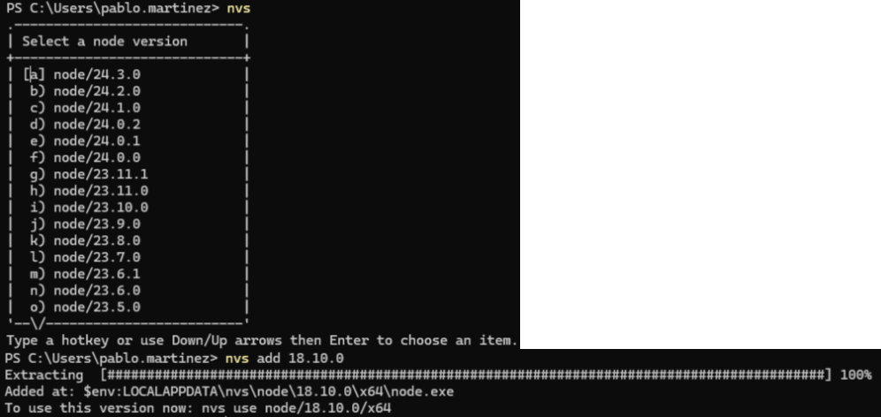
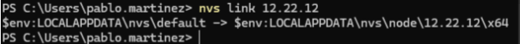

# Use different versions of Node

## NVS - Diferent versions of node without admin rights

https://github.com/jasongin/nvs

Once installed for our user, if we run the command "nvs", a list of available versions will appear. We can search for it by scrolling (using the up/down arrows) or by typing nvs add XX.YY.ZZ if we already know the version.



Once one or more versions are installed, we can switch between them by typing nvs, or by typing nvs use XX.YY.ZZ


Every time we want to run something with Node.js, we have to type `nvs` and select the version using the arrow keys or `nvs use`.
This is independent for each terminal we open, as it modifies the path for that moment. Want to set a default version? We use `nvs link XX.YY.ZZ`



This will set this version as the default for all terminals opened from now on (regardless of whether they can later modify the version used in the terminal).

If, for example, running "npm install" fails due to security policies

```
npm : No se puede cargar el archivo C:\Users\manuel.tobio\AppData\Local\nvs\node\18.20.8\x64\npm.ps1 porque la ejecución de scripts está deshabilitada en este sistema. Para obtener más información, consulta el tema about_Execution_Policies en https:/go.microsoft.com/fwlink/?LinkID=135170.
```

Simply run the following command in PowerShell:

```
> Set-ExecutionPolicy -Scope CurrentUser unrestricted
```
